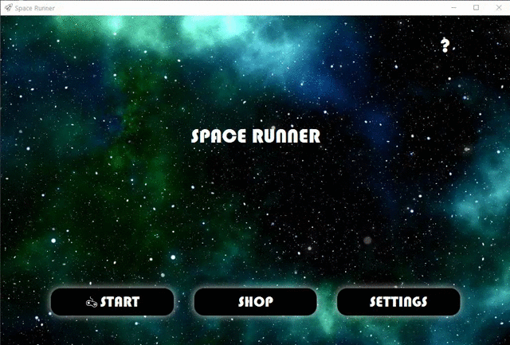
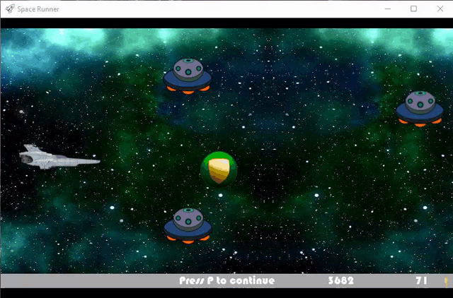
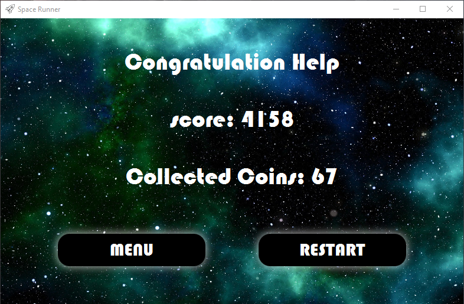
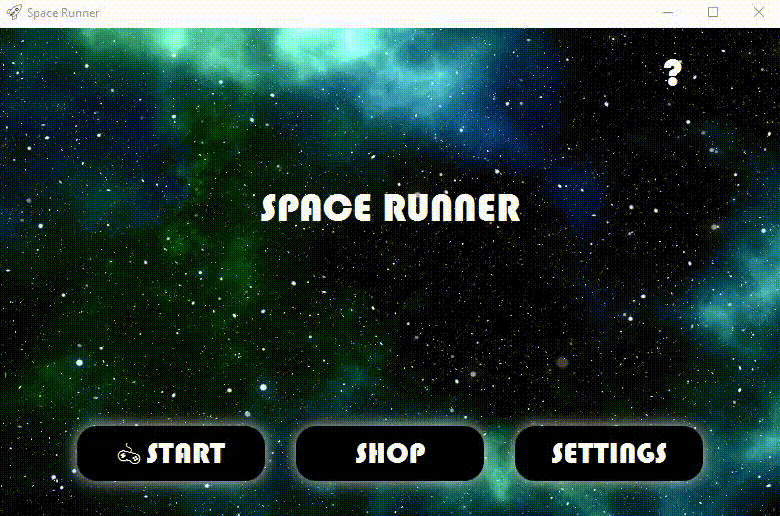
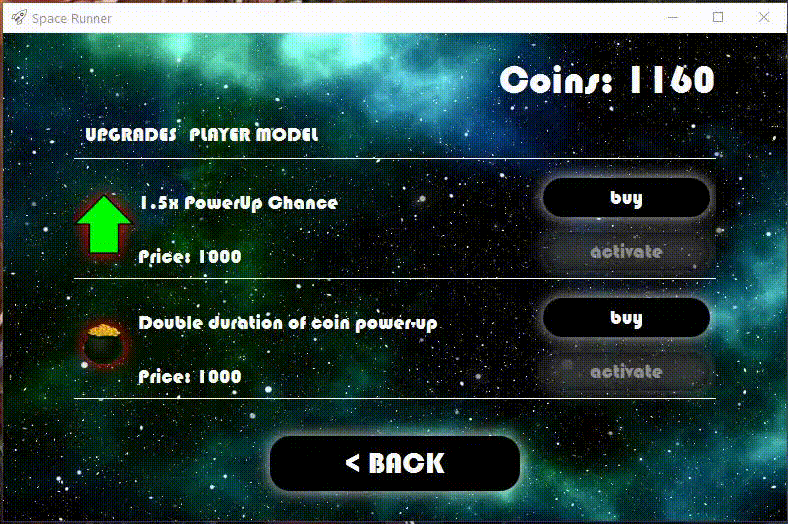
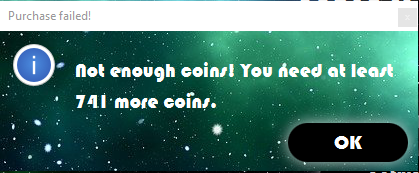
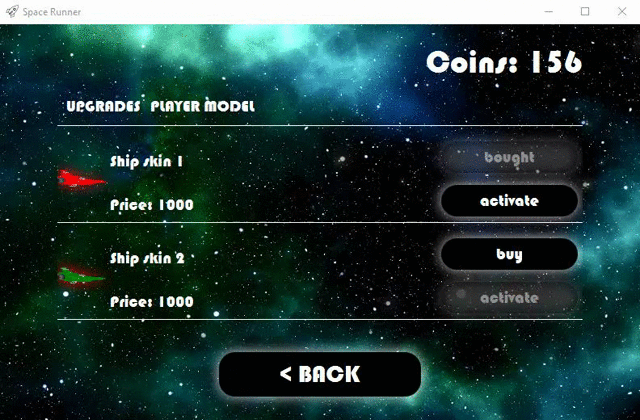
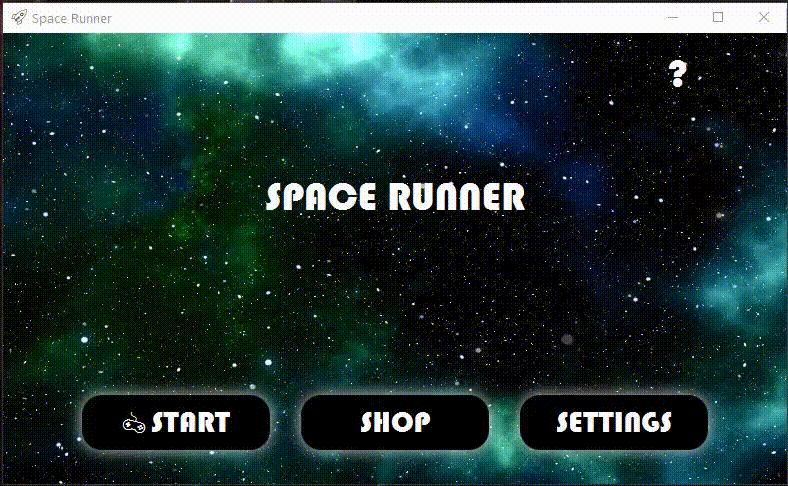
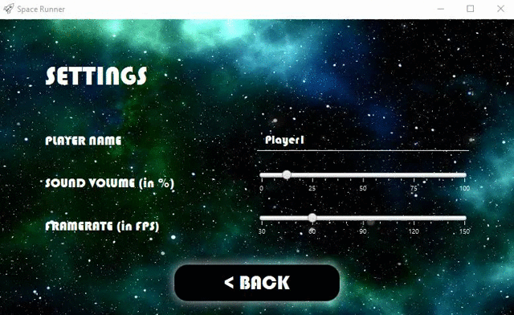
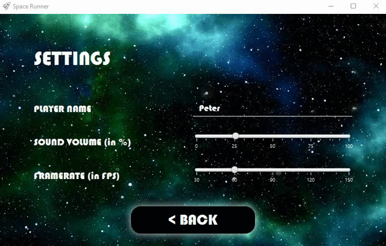

# Space-Runner
## Instructions
### Welcome
Welcome to our project: Space-Runner. We are 6 engineering Students at the ZHAW. First you will get an instruction on how to set-up the project, How to Play, testing and the project outlines and how far we've progressed.

### Set-Up
Make sure Java 11 or higher is installed on your system.

Clone the project to a local folder and opn it with an IDE (gradle preinstalled).
Start it by entering "gradle run" in the terminal.

If you want to test the beta of the game, get the [version 1.0 beta release](https://github.zhaw.ch/islermic/PM3-HS20-IT19a_WIN-Team03/releases).
Extract the zip file and run the jar by double clicking or opening the command prompt and start it by using the command: "java -jar SpaceRunner.jar"

### How To Play
First you need to start the programm. Then you are greeted by the main screen where you can choose between **"START"**, **"SHOP"** and **"SETTINGS"**. In the next sections you will get more information about these three actions. You can also find help in the game by clicking on the question mark button.  
    

#### Start
During the game run your space ship will encounter many space elements, the goal is to collect them or avoid them by moving the space ship verticaly.  
* You should collect the coins, because you can use them in the store to buy items.  
* You should also pick up the PowerUps, because they can strengthen your space ship.  
* With the other space elements you should avoid any contact, obstacles (rockets, UFOs and asteroids) will destroy your space ship and your run is over.  

After pressing the **"START"** button you will came to the game view  with the space ship. Then you need to Press **SPACE** to start the run. When in game you can use the :arrow_up: button and the :arrow_down: button for moving the space ship verticaly.   
    
* With the **"P"** button you can pause and resume the game at any time.  
    
* If you grab a Coin PowerUp, it will be activ for a certain period of time.  
  * The Coin PowerUp can overlap each other.
* If you grab a Shield PowerUp, it will remain active until you collide with an obstacle.  
  * You can't stack Shield PowerUps.  
    
* You collide with an obstacle and have an active Shield PowerUp, you will lose your Shield PowerUp at this point, but the run is not terminated. In this example, a collision with a rocket.  
    
* When the Coin PowerUp is active, the coins that are collected are duplicated. In this example, eight coins are visually collected and counted 16.  
    
* After you collide with an obstacle and you don't have a Shield PowerUp, you end the run. You see the game over screen, with your score or your new highscore if you have overbeet it in this run. Then you can decide between the next two options:  
  * **"MENU"**: You go back to the main screen  
  * **"RESTART"**: You will start a new run  
    

#### Shop
If you click on the **"SHOP"** button, you will land here. In the Shop you can buy and manage upgrades or player models.
* Upgrades
  * 1.5x PowerUp chance (The chance that PowerUp will appear is increased)
  * Double duration of Coin PowerUp (Increases the duration of Coin PowerUp from 10 to 20 seconds)
* Player model
  * Ship Skin 1 (red space ship)
  * Ship Skin 2 (green space ship)  
  

* If you have enough coins to buy an item you can click on the "buy" button next to the item. Another small window will appear that ask you asking you if you really want to buy this item. So you can purchase  or cancel the item. It works the same for the upgrades and the playermodel.  
  

* This warning is displayed if you do not have enough coins to buy something in the store. It also indicates how many coins you are missing to buy this item. 
  
  
* If you have bought a skin, you can activate and deactivate it, so you can also switch between skins. For the upgrades the activation works exactly the same.  
    

#### Settings
If you click on the **"SETTINGS"** button, you will land here. In the settings you can set the player name or change the sound and the framerate.  
  

* You can change the player name by overwriting it.  
  

* You can adjust the sound and framerate by moving the button.  
    

## Project Outlines
### Brief Summary
The goal of the Project is to create a Endless Sidescroller similar to Jetpack Joyride or Templerun. 

## Pull Request
Pull requests are merged and discussed together on a voice chat (e.g. Discord/Teams). Feedback is directly provided per voice.

## Testing
We tested what we could but since it's a Game most of the testing couldn't be done with JUnit.

## External Ressources
Link to Wiki:
[External Resources](https://github.zhaw.ch/islermic/PM3-HS20-IT19a_WIN-Team03/wiki/External-Resources)

## Meetings
The following meetings and iteration sections show the progress of the project. 

[Meeting 2.10.2020](https://github.zhaw.ch/islermic/PM3-HS20-IT19a_WIN-Team03/issues/2)

[Meeting 5.10.2020](https://github.zhaw.ch/islermic/PM3-HS20-IT19a_WIN-Team03/issues/3)

[Meeting 9.10.2020](https://github.zhaw.ch/islermic/PM3-HS20-IT19a_WIN-Team03/issues/4)

[Meeting 12.10.2020](https://github.zhaw.ch/islermic/PM3-HS20-IT19a_WIN-Team03/issues/6)

[Meeting 16.10.2020](https://github.zhaw.ch/islermic/PM3-HS20-IT19a_WIN-Team03/issues/7)

[Meeting 19.10.2020](https://github.zhaw.ch/islermic/PM3-HS20-IT19a_WIN-Team03/issues/8)

[Meeting 21.10.2020](https://github.zhaw.ch/islermic/PM3-HS20-IT19a_WIN-Team03/issues/9)

[Meeting 23.10.2020](https://github.zhaw.ch/islermic/PM3-HS20-IT19a_WIN-Team03/issues/10)

[Meeting 30.10.2020](https://github.zhaw.ch/islermic/PM3-HS20-IT19a_WIN-Team03/issues/53)

[Meeting 2.11.2020](https://github.zhaw.ch/islermic/PM3-HS20-IT19a_WIN-Team03/issues/66)

[Meeting 6.11.2020](https://github.zhaw.ch/islermic/PM3-HS20-IT19a_WIN-Team03/issues/93)

[Meeting 9.11.2020](https://github.zhaw.ch/islermic/PM3-HS20-IT19a_WIN-Team03/issues/100)

[Meeting 13.11.2020](https://github.zhaw.ch/islermic/PM3-HS20-IT19a_WIN-Team03/issues/109)

[Meeting 16.11.2020](https://github.zhaw.ch/islermic/PM3-HS20-IT19a_WIN-Team03/issues/130)

[Meeting 20.11.2020](https://github.zhaw.ch/islermic/PM3-HS20-IT19a_WIN-Team03/issues/121)

[Meeting 23.11.2020](https://github.zhaw.ch/islermic/PM3-HS20-IT19a_WIN-Team03/issues/131)

[Meeting 27.11.2020](https://github.zhaw.ch/islermic/PM3-HS20-IT19a_WIN-Team03/issues/132)

[Meeting 30.11.2020](https://github.zhaw.ch/islermic/PM3-HS20-IT19a_WIN-Team03/issues/135)

[Meeting 04.12.2020](https://github.zhaw.ch/islermic/PM3-HS20-IT19a_WIN-Team03/issues/136)

 

[Iterations-Review 2](https://github.zhaw.ch/islermic/PM3-HS20-IT19a_WIN-Team03/issues/5)

[Iterations-Review 3](https://github.zhaw.ch/islermic/PM3-HS20-IT19a_WIN-Team03/issues/33)

[Iterations-Review 4](https://github.zhaw.ch/islermic/PM3-HS20-IT19a_WIN-Team03/issues/97)

[Iterations-Review 5](https://github.zhaw.ch/islermic/PM3-HS20-IT19a_WIN-Team03/issues/127)

